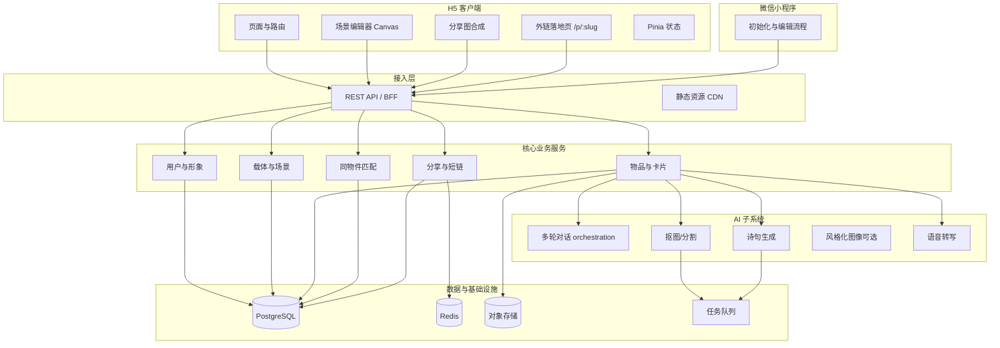
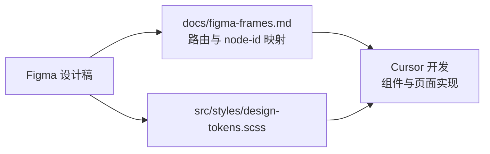

# 兴趣清单生成器 — 技术解决方案

## 文档信息

| 字段 | 内容 |
|------|------|
| 文档版本 | v1.4 |
| 创建日期 | 2026-04-04 |
| 对应 PRD | `PRD_兴趣清单生成器.md` v1.4 |
| 产品形态 | 移动端 H5（建议 iPhone 14 视口优先适配） |
| UI 设计源 | **Figma**（界面设计稿已完成，开发与验收以此为准） |
| 设计稿引用 | 与 PRD 附录一致，见 **§2.5**（可自行替换为最新文件链接与节点） |

---

## 一、概述与目标

### 1.1 文档目的

在 PRD 已定义的产品能力基础上，给出**可落地的技术架构**、**服务边界**、**数据模型要点**以及**前后端仓库内的文件组织方式**，供研发拆分任务与评审使用。界面层实现以 **Figma 设计稿**为唯一视觉与交互规格，在 **Cursor** 中完成编码与联调时与设计稿对齐。

### 1.2 范围对齐（来自 PRD）

| 域 | MVP 技术侧需覆盖 |
|----|------------------|
| 用户 | 预制头像、个人中心、换头像 |
| 载体 | 多类型模板（PRD 写 6 种上线）、列表增删、场景搭建（放置、层级、辅助线）、样式自定义（颜色/背景/尺寸/装饰） |
| 物品 | 拍照/相册/裁剪、抠图、AI 多轮对话（文/语/图）、故事与元数据、**AI 诗句**、**同物件人数**、**他人诗句（按住预览交互）** |
| 分享 | 载体/清单级分享卡片（模板、预览、高清导出）、**外链落地页**（微信/小红书：仅成品卡 + 分享者载体目录，**无物品故事详情**；CTA 跳转**微信小程序**拉新） |
| 非 MVP | 同好发现深度社交、多端同步完整方案可分期 |

### 1.3 非功能目标

- **首屏与列表**：弱网下图与列表可用；大图走 CDN + 渐进加载。  
- **AI 链路**：对话与诗句生成**异步可重试**；抠图/风格化等重任务走**任务队列**，前端轮询或 WebSocket 推送状态。  
- **隐私**：物品/载体级可见性；他人诗句仅在「公开」策略下返回；敏感字段最小展示。  
- **外链落地页（PRD §4.5.2）**：匿名访问**只读**；接口与前端路由均**不得**暴露他人物品故事、音频、私密图；列表项**无**合法跳转至物品详情；需适配**微信内置浏览器 / 小红书 WebView / 系统浏览器**的兼容与平台外链规范。

### 1.4 设计与研发协作（Figma + Cursor）

- **设计已完成**：各界面已在 Figma 中绘制，开发阶段**不再凭想象补 UI**，以设计稿为准；PRD 负责范围与逻辑，Figma 负责像素、间距、状态与组件形态。  
- **推荐工作流**：在 Figma 中选中目标 Frame → 复制带 `node-id` 的分享链接 → 在 Cursor 对话或任务描述中粘贴链接，并指明路由/组件名，便于 AI 或协作者对齐上下文。  
- **验收标准**：关键页面（初始化、个人中心、载体列表/编辑、物品录入与卡片、分享预览、**外链落地页 §4.5.2**）需与对应 Frame **结构一致**；色值、圆角、字号优先采用 Figma Variables / 样式库，并落到代码中的 **Design Tokens**（见 §2.5、§9）。  
- **可选工具链**：若已启用 **Figma MCP**（如 Cursor 中的 Figma 集成），可从设计文件拉取节点结构、标注与资源说明，减少手抄尺寸；**不依赖** MCP 时，仍可通过导出切图 + 手动维护 `design-tokens` 完成交付。

---

## 二、技术选型建议

| 层级 | 建议选型 | 说明 |
|------|----------|------|
| H5 客户端 | **Vue 3 + Vite + TypeScript** + Vue Router + Pinia | 组件化与状态管理成熟；亦可替换为 React + Zustand，目录组织思路类似 |
| UI | **Figma 稿为基准** + 移动端适配：`postcss-px-to-viewport` 或 `rem`；设计稿宽度与 Figma Frame（如 iPhone 14）一致 | 与 PRD「iPhone14 预览」一致；色板以 Figma / PRD 主色 **#8470FF** 为准，冲突时以 **Figma 当前稿** 为准并回写 PRD |
| 画布/场景 | **Fabric.js** 或 **Konva**（2D 场景内物品拖拽、层级、对齐线） | 复杂合成可辅以离屏 Canvas |
| 分享图导出 | `html2canvas` 或纯 Canvas 绘制 + `toDataURL` / `toBlob` | 需处理跨域图与高清倍率 |
| 后端 API | **Node.js + NestJS**（或 Spring Boot / Go Gin，结构同理） | 模块化与依赖注入利于按领域拆分 |
| 数据库 | **PostgreSQL**（主业务）+ **Redis**（会话、限流、任务状态） | JSON 字段存场景布局、卡片配置 |
| 对象存储 | **S3 兼容**（阿里云 OSS / 腾讯云 COS 等） | 原图、抠图结果、音频、分享图 |
| AI | 对话与诗句：**大模型 API**（流式 SSE）；抠图：**专用分割 API** 或自研模型服务 | 与业务 API 解耦，独立 `ai-gateway` 亦可；**产品侧自操作说明**见同仓库 **`技术方案_AI模型接入指南.md`** |

### 2.5 Figma 设计稿与工程映射

| 约定项 | 说明 |
|--------|------|
| **主文件** | 与 PRD `13.2` 设计稿链接保持一致；文件迭代后在此表或 `docs/figma-frames.md` 更新 URL。示例：`https://www.figma.com/design/vt9q9x6LlIuiKtlIoLy6FR/草稿?node-id=504` |
| **页面 ↔ Frame** | 建议在仓库维护 **`docs/figma-frames.md`**：列出「路由 / Vue 页面路径 / Figma Page 与 Frame 名称 / node-id」，避免口口相传。 |
| **组件 ↔ 组件** | Figma 中 Components 与 `src/components`、`src/views` 命名尽量可对应（如 `ItemCard` ↔ Frame「物品卡片」）；复杂模块可一页多 Frame（默认态、空态、加载态）。 |
| **切图与矢量** | 图标、插画、载体背景等：Figma **Export**（SVG/PNG @2x/@3x）导出至 `src/assets/figma/` 或 OSS；大图走 CDN，**不在仓库堆原 PSD**。 |
| **Design Tokens** | 颜色、字号、圆角、间距：从 Figma Variables / Styles 抄录到 `src/styles/design-tokens.scss`（或 CSS Variables），提交时注明「同步自 Figma 某日期」，减少漂移。 |
| **外链落地页** | PRD **§4.5.2** + **§7.3.2**：单独 Page/Frame 组（成品卡片区、载体列表区、禁用详情态、**进小程序** CTA）；与 **§7.3.1 分享成品卡片** Frame 区分（导出图 vs 落地页布局）。 |

---

## 三、总体架构

### 3.1 逻辑架构图



### 3.2 设计到代码链路（Figma + Cursor）



- **Cursor 侧**：实现某屏时，任务描述携带 **Figma 链接（含 node-id）** + 对应 `views/*.vue` 路径；需要还原动效或多状态时，注明 Frame 名称。  
- **变更流程**：设计稿改版 → 先更新 Figma → 再改 Tokens/切图 → 最后改代码；避免代码与稿双向打架。

### 3.3 部署视图（简）

- **H5（主应用）**：构建产物部署至 OSS + CDN，入口 HTML 由网关或静态站点托管；**外链落地页**可与主包同域路由 `/p/:slug`，或单独子路径/子域（便于缓存策略隔离）。  
- **微信小程序**：独立构建与提审；与同一套 **API / OSS** 对接；从外链页通过 **URL Scheme / URL Link** / 微信开放标签等跳转（以微信平台当前合规方式为准）。  
- **API**：容器化部署，水平扩展；上传走**直传预签名 URL**（减轻 API 带宽）。  
- **AI**：可同一集群 Sidecar，或独立服务 + 内网调用；**密钥仅服务端**。

---

## 四、核心领域模块（与 PRD 映射）

| 领域模块 | 职责 | PRD 章节 |
|----------|------|----------|
| Identity | 用户标识、会话、预制头像资源表 | 4.1 |
| Carrier | 载体类型元数据、用户载体实例、主题配置（色/背景/装饰） | 4.2 |
| Scene | 载体画布内物品实例：位置、缩放、旋转、zIndex、对齐辅助 | 4.2.3、4.3.4 |
| Item | 物品主记录、多图、音频、故事文本、AI 会话状态机、诗句定稿 | 4.3 |
| CanonicalItem | **同一物件**标准化记录（用于人数统计与他人诗句聚合） | 4.3.3 |
| Share | 分享卡片模板、渲染参数、短链、**公开落地页（PRD §4.5.2）** | 4.5.1、4.5.2、5.2 |

---

## 五、关键业务流程（技术要点）

### 5.1 初始化链路（首次）

1. 匿名或一键登录 → 写入 `user`、`user_profile`（头像 ID）。  
2. 创建首个 `carrier` → 拉取载体模板配置（JSON）。  
3. 创建 `item`：`upload` → 触发 `segmentation_job` → 回调写入 `cutout_url`。  
4. `ai_session` 多轮：问题列表由服务端模板 + LLM 动态生成；支持中途 `attachment` 上传（新 OSS key）。  
5. 用户确认故事 → `poem_job` → 写入 `item.ai_poem`；`MatchSvc` 更新 `canonical_item_id` 与计数缓存。  
6. `scene_item` 写入默认或用户拖拽坐标 → `share_asset` 生成预览图。

### 5.2 他人诗句交互（PRD：按住切换）

- 接口返回：`myPoem`、`othersPoems[]`（仅公开策略）、`ownerCount`。  
- 前端：诗句区域 `pointerdown` 显示轮播/随机他人句，`pointerup`/`pointercancel` 恢复本人句；需防抖与无障碍替代（长按相同语义）。

### 5.3 同物件匹配（Canonical）

建议 **MVP 规则**（可配置）：  
1. 用户选定载体类目 `category` + 规范化 `title_norm`（去空格、小写、同义词表）。  
2. 可选：用户补充 `brand`、`model` 参与哈希键 `canonical_key = hash(category, title_norm, brand?, model?)`。  
3. 新建物品时 **upsert** `canonical_items`，`item.canonical_id` 外键；`owner_count` 用计数表或定时聚合避免实时全表 count。

### 5.4 外链落地页与小程序转化（PRD §4.5.1 / §4.5.2）

与 PRD **外站分享展示规则**一一对应的实现约束如下。

| PRD 规则 | 技术实现要点 |
|----------|----------------|
| 可见：成品卡片 | 落地页首屏使用 **`hero_image_url`**（分享导出图存 OSS）或服务端按快照参数重新渲染；与 **§7.3.1** 成品卡视觉一致。 |
| 可见：对方载体列表 | `GET /p/:slug` 返回分享者 **`carriers[]` 目录**（`title`、`cover_thumb`、`template_type`、可选 `item_count` 等）；数据范围受分享者**隐私/公开范围**过滤，仅包含允许外展的载体。 |
| 不可点：详细故事 | **不返回** `story_text`、`story_audio_url`、`extra_photo_urls`、物品详情 ID 的可解析跳转；前端列表组件**无** `router.push` 至 `/items/:id`；若点击行，仅允许 Toast/弹层引导「打开小程序生成自己的清单」（PRD 弱反馈）。 |
| 转化：进小程序 | 主 CTA 配置 **`miniprogram_app_id` + 路径**（或 URL Link）；携带 `utm_*`、`from_share_slug` 归因写入小程序启动参数。 |
| 合规与预期 | `share_link` 带 **`visibility` / `expires_at`**；失效返回 410/专用空态页；微信与小红书内嵌 WebView 需单独做 **JS-SDK / 开放标签**检测与降级文案。 |

**简要时序**：分享者生成 `slug` → 海报二维码指向 `https://{domain}/p/{slug}` → 访客打开 → BFF 校验 slug → 返回公开 DTO → 渲染 **PublicShareLanding** → 用户点击 CTA → 拉起微信小程序 → 小程序内走 **§5.1 初始化链路**（新用户）。

---

## 六、数据模型概要（表级）

> 字段名仅为示意，实施时可按 ORM 命名习惯调整。

**user** — `id`, `openid`/手机号哈希, `created_at`  
**user_profile** — `user_id`, `avatar_preset_id`, `nickname`  
**carrier_template** — `id`, `type_key`, `display_name`, `layout_config_json`, `asset_manifest_json`  
**carrier** — `id`, `user_id`, `template_id`, `theme_json`, `created_at`  
**item** — `id`, `user_id`, `carrier_id`, `title`, `story_text`, `story_audio_url`, `cutout_url`, `extra_photo_urls[]`, `ai_poem`, `canonical_id`, `visibility`, `created_at`  
**ai_session** — `id`, `item_id`, `state`, `messages_json`, `updated_at`  
**canonical_item** — `id`, `canonical_key`, `category`, `display_title`, `owner_count`  
**scene_item** — `id`, `carrier_id`, `item_id`, `x`, `y`, `scale`, `rotation`, `z_index`  
**share_link** — `id`, `slug`, `sharer_user_id`, `primary_carrier_id`（发起分享时焦点载体，用于快照与文案）, `hero_image_url`（成品卡图，与 PRD 4.5.1 导出一致）, `visibility`（公开范围，与 PRD「仅好友」等策略对齐）, `expires_at`, `meta_json`（utm、模板版本等）

索引建议：`item(user_id, carrier_id)`、`item(canonical_id)`、`scene_item(carrier_id, z_index)`、`share_link(slug)` 唯一。

---

## 七、API 设计概要（REST 示例）

| 方法 | 路径 | 说明 |
|------|------|------|
| POST | `/auth/anonymous` | 设备号换 token（MVP） |
| GET/PUT | `/me/profile` | 个人中心、换头像 |
| GET/POST | `/carriers` | 载体列表、创建 |
| GET/PATCH/DELETE | `/carriers/:id` | 详情、主题、删除 |
| GET/PUT | `/carriers/:id/scene` | 场景内 `scene_item[]` 批量更新 |
| POST | `/carriers/:id/share` | 生成分享图任务，返回 `job_id` |
| GET | `/carriers/:id/share/preview` | 预览 URL |
| GET/POST | `/items` | 物品列表（可按 carrier 过滤）、创建 |
| GET/PATCH/DELETE | `/items/:id` | 详情、编辑、删除 |
| POST | `/items/:id/photos` | 预签名上传补充照片 |
| POST | `/items/:id/ai/messages` | 发送用户消息，返回助手回复（可 SSE） |
| POST | `/items/:id/ai/poem` | 触发生诗 / 重新生成 |
| GET | `/items/:id/social` | `ownerCount` + `othersPoems`（权限过滤后） |
| POST | `/jobs/:id/poll` | 抠图/导出任务轮询 |
| GET | `/p/:slug` | **外链落地页数据（匿名）**，PRD **§4.5.2**；仅公开 DTO，见下文 |

**`GET /p/:slug` 响应（PublicLandingDTO，严禁超集泄露）**  
- **sharer**：`nickname`、`avatar_url`（可脱敏）；**不含**用户手机、openid。  
- **hero**：`hero_image_url`（与 **§7.3.1** 成品分享卡一致，对应 PRD 4.5.1）。  
- **carriers**：分享者对外可见的载体**目录数组**（PRD「对方载体列表」）：`id`、`title`、`cover_thumb`、`template_type`、可选 `item_count`；**禁止** `items` 嵌套详情。  
- **cta**：`miniprogram`：`appId`、`path` 或 `urlLink` 占位字段（由配置中心注入）；`query` 含 `from_share_slug`、`utm_*`。  

**匿名访客禁止**：`GET /items/:id`、`GET /items/:id/social` 等在落地页场景下**一律 401/403**（除非未来单独设计「带 token 的好友鉴权」，见 PRD 合规行）。二维码仅指向 **`/p/:slug`**，不指向带物品 id 的深度链接。

---

## 八、AI 子系统

| 能力 | 输入 | 输出 | 实现要点 |
|------|------|------|----------|
| 多轮引导 | 物品名、用户答、可选图片 URL | 下一轮问题或总结 | Prompt 模板 + 工具调用（结构化字段写入） |
| 抠图 | 原图 OSS | 抠图 PNG URL | 异步 job；失败允许用户选手动描边（后期） |
| 诗句 | 故事 + 元数据 + 可选图理解 | 定稿文本 | 温度适中；支持「换一版」版本号 `poem_version` |
| 语音 | 音频流/文件 | 文本 | ASR API；与 `story_text` 合并策略 |
| 风格化照片 | 原图 | 风格图 URL | 可选 MVP 后；同样走队列 |

**提示词与模型版本**建议单独配置在服务端（环境变量或配置中心），勿下发前端。

---

## 九、前端（H5）文件组织

推荐 **Monorepo 子目录** `apps/web` 或独立仓库根目录如下。与 **Figma + Cursor** 协作相关的路径单独标出。

```
apps/web/
├── index.html
├── vite.config.ts
├── tsconfig.json
├── package.json
├── docs/                       # 【Figma】可选：与仓库同级的 monorepo 则用根目录 docs/
│   └── figma-frames.md         # 路由 / 页面 ↔ Figma Frame / node-id 对照表（强建议维护）
├── public/
│   └── favicon.ico
├── src/
│   ├── main.ts                 # 入口
│   ├── App.vue
│   ├── router/
│   │   ├── index.ts
│   │   └── routes.ts           # 初始化 / 个人中心 / 载体 / 物品 / 分享；含 /p/:slug 外链（独立布局、无登录态）
│   ├── stores/                 # Pinia
│   │   ├── user.ts
│   │   ├── carrier.ts
│   │   ├── item.ts
│   │   └── aiChat.ts
│   ├── api/                    # axios 实例 + 模块 API
│   │   ├── client.ts
│   │   ├── auth.ts
│   │   ├── user.ts
│   │   ├── carriers.ts
│   │   ├── items.ts
│   │   ├── ai.ts
│   │   ├── share.ts
│   │   └── publicShare.ts      # GET /p/:slug，仅 PublicLandingDTO
│   ├── assets/
│   │   ├── figma/              # 【Figma】从设计稿 Export 的切图（按页面或模块分子目录）
│   │   └── ...                 # 其余小图标；大图仍优先 OSS
│   ├── styles/
│   │   ├── design-tokens.scss  # 【Figma】颜色/字号/圆角/间距，与 Variables 同步
│   │   ├── variables.scss      # 可合并入 tokens，或仅作别名转发
│   │   └── global.scss
│   ├── composables/            # 通用逻辑
│   │   ├── useUpload.ts
│   │   ├── useAudioRecorder.ts
│   │   └── usePoemPreview.ts   # 按住他人诗句
│   ├── types/
│   │   ├── user.ts
│   │   ├── carrier.ts
│   │   ├── item.ts
│   │   └── api.ts
│   ├── utils/
│   │   ├── image.ts
│   │   ├── canvas-export.ts
│   │   └── canonical.ts        # 前端展示用，真正匹配在后端
│   ├── components/             # 通用 UI
│   │   ├── AppHeader.vue
│   │   ├── AvatarPicker.vue
│   │   ├── PoemSwitch.vue      # 本人/他人诗句按住交互
│   │   ├── ShareExportPanel.vue
│   │   └── CarrierDirectoryPublic.vue  # 外链页载体列表，无详情跳转
│   └── views/                  # 页面（可按 feature 分子目录）
│       ├── onboarding/
│       │   ├── OnboardingAvatar.vue
│       │   ├── OnboardingCarrier.vue
│       │   └── OnboardingFirstItem.vue
│       ├── profile/
│       │   └── ProfileHome.vue
│       ├── carrier/
│       │   ├── CarrierList.vue
│       │   ├── CarrierEditor.vue    # 内嵌场景画布
│       │   └── CarrierTheme.vue
│       ├── item/
│       │   ├── ItemCapture.vue      # 拍照/裁剪
│       │   ├── ItemAiChat.vue       # AI 对话
│       │   ├── ItemCard.vue         # 卡片七要素布局
│       │   └── ItemList.vue
│       └── share/
│           ├── SharePreview.vue       # App 内预览导出
│           └── PublicShareLanding.vue # 外链 /p/:slug，PRD §4.5.2
└── tests/
    └── ...
```

**路由与 PRD 链路对应建议**

- `/onboarding/*` → §5.1 初始化  
- `/profile` → 个人中心  
- `/carriers` → 载体列表 + 分享入口  
- `/carriers/:id` → 场景编辑  
- `/carriers/:id/items` → 物品列表  
- `/items/new` / `/items/:id` → 添加/编辑物品与 AI 卡片  
- `/p/:slug` → **PublicShareLanding.vue**（PRD §4.5.2、§7.3.2）；**勿**挂载需登录的父布局，避免误带 Token 策略  

**说明**：若 `docs/` 放在 **Monorepo 根目录**而非 `apps/web/` 下，仅需保证团队约定唯一、且 `figma-frames.md` 可被 Cursor/全员找到。

---

## 十、后端（API）文件组织

以 **NestJS** 为例，`apps/api/src`：

```
apps/api/
├── main.ts
├── app.module.ts
├── config/
│   ├── database.config.ts
│   ├── oss.config.ts
│   ├── ai.config.ts
│   └── wechat.config.ts        # 小程序 appId、URL Link 等（密钥仅服务端）
├── common/
│   ├── guards/
│   ├── interceptors/
│   ├── filters/
│   └── decorators/
├── modules/
│   ├── auth/
│   │   ├── auth.module.ts
│   │   ├── auth.controller.ts
│   │   ├── auth.service.ts
│   │   └── strategies/
│   ├── user/
│   │   ├── user.module.ts
│   │   ├── user.controller.ts
│   │   ├── user.service.ts
│   │   └── entities/user.entity.ts
│   ├── carrier/
│   │   ├── carrier.module.ts
│   │   ├── carrier.controller.ts
│   │   ├── carrier.service.ts
│   │   ├── entities/
│   │   └── dto/
│   ├── item/
│   │   ├── item.module.ts
│   │   ├── item.controller.ts
│   │   ├── item.service.ts
│   │   ├── ai-chat.service.ts
│   │   ├── poem.service.ts
│   │   └── entities/
│   ├── scene/
│   │   ├── scene.module.ts
│   │   ├── scene.service.ts
│   │   └── entities/scene-item.entity.ts
│   ├── canonical/
│   │   ├── canonical.module.ts
│   │   ├── canonical.service.ts   # 同物件匹配与计数
│   │   └── entities/
│   ├── share/
│   │   ├── share.module.ts
│   │   ├── share.controller.ts
│   │   ├── public-landing.controller.ts  # GET /p/:slug，匿名可读，DTO 白名单
│   │   ├── share-render.service.ts
│   │   ├── public-landing.service.ts       # 组装 PublicLandingDTO、校验 slug/visibility
│   │   ├── dto/
│   │   │   ├── public-landing.dto.ts
│   │   │   └── ...
│   │   └── entities/
│   ├── upload/
│   │   ├── upload.module.ts
│   │   └── presign.service.ts
│   └── jobs/
│       ├── jobs.module.ts
│       ├── segmentation.processor.ts
│       └── export-card.processor.ts
├── integrations/
│   ├── llm/
│   │   └── openai-compatible.client.ts
│   ├── oss/
│   │   └── s3.client.ts
│   ├── asr/
│   │   └── asr.client.ts
│   └── wechat/
│       └── urllink.client.ts   # 可选：URL Link / 服务端票据
└── database/
    ├── migrations/
    └── seeds/                    # carrier_template 种子数据
```

---

## 十一、载体模板与静态资源

- **视觉来源**：载体背景、装饰、占位骨架等**以 Figma 导出资源为准**，与 `carrier_template` 的 `asset_manifest_json` 中路径一一对应；设计迭代后替换导出文件并 bump 模板 `version`。  
- **模板定义**：`carrier_template.layout_config_json` 描述可放置区域（多边形或矩形槽位）、背景层 id、装饰层列表（可与 Figma 中图层命名对齐，便于沟通）。  
- **仓库目录（可选）**：`packages/carrier-assets/` 或 `src/assets/figma/carriers/` 存各 `type_key` 的切图与 `manifest.json`，构建时同步到 OSS。  
- **版本化**：模板带 `version` 字段，避免老用户场景错位；前端按版本选解析器。

---

## 十二、分享卡片生成与外链落地（对齐 PRD §4.5.1、§7.3）

### 12.1 分享成品卡片（导出图 / 海报）

对应 PRD **§4.5.1 卡片元素** 与 **§7.3.1**：

1. 合成方式：**MVP 可客户端 Canvas / html2canvas**；高清用 **2x/3x 离屏 Canvas**。  
2. **版式以 Figma「分享成品卡片」Frame 为准**（§7.3.1）。层次建议：**用户信息区（头像/昵称）** → **场景区（当前载体 + `scene_item`）** → **清单信息区（名称、件数、可选统计）** → **落地入口区（二维码/品牌）**。  
3. 二维码：仅含 **`https://{domain}/p/{slug}`** + `utm`；文案与视觉**不暗示**可在外链阅读他人「我的故事」全文（与 PRD 4.5.1、7.3.1 一致）。  
4. 生成分享时后端写入 **`share_link`**（含 `hero_image_url`、`sharer_user_id`、`primary_carrier_id`、`slug`、`visibility`）。

### 12.2 外链落地页（微信 / 小红书内打开）

对应 PRD **§4.5.2** 与 **§7.3.2**：

- **上区**：与成品卡视觉连续（`hero_image_url` 或等价组件）。  
- **中区**：**载体目录列表**组件——仅 PRD 允许字段；无详情路由；点击行策略与 PRD「弱反馈」一致。  
- **下区 / 底栏**：主 CTA **进入小程序**；配置来自 **`GET /p/:slug` 的 `cta.miniprogram`**。  
- **状态页**：slug 失效、非微信内打开提示、加载中与错误态（Figma 单独 Frame）。

---

## 十三、安全与合规

- 全站 HTTPS；JWT 或 Session 存 HttpOnly Cookie（按 H5 部署域选择）。  
- OSS 私有桶 + 签名 URL；**禁止**前端直持 AI Key。  
- 上传：**类型校验、大小限制、可选图片鉴黄接口**。  
- `visibility` 与 `othersPoems` 接口必须服务端强制过滤。  
- **外链落地页**：匿名接口白名单字段，**禁止**拼接物品故事、音频、未公开图；防爬虫可限流 + 短期 token；**禁止**在 HTML 内嵌完整 `items` JSON。  
- **微信 / 小红书**：遵守各自外链、二维码与小程序跳转规则；敏感能力（拉起小程序）优先使用**官方开放标签 / URL Link**，避免违规 Scheme。  
- 日志脱敏（openid、手机号）。

---

## 十四、部署与环境

| 环境 | 用途 |
|------|------|
| dev | 本地 Docker Compose：Postgres + Redis + MinIO |
| staging | 联调 AI 沙箱、真实 OSS 测试桶 |
| prod | 多可用区、数据库备份、CDN 缓存策略分离 HTML 与 hash 静态资源 |
| 微信小程序 | 独立流水线构建上传、提审发布；配置服务端 **appId / secret**（仅后端）；与 H5 共用 API 基地址与环境变量规范 |

---

## 十五、PRD 功能 — 技术项追踪表

| PRD 能力 | 技术落点 |
|----------|----------|
| 全站 UI | **Figma 设计稿** + `design-tokens.scss` + `docs/figma-frames.md`；Cursor 任务带 node-id 链接 |
| 换头像 | `user_profile.avatar_preset_id` + 静态资源表 |
| 载体 6 种 | `carrier_template` 种子 + `type_key` |
| 场景拖拽/层级/对齐线 | 前端 Canvas + `scene_item` 持久化 |
| AI 对话 + 补照片 | `ai_session` + 附件 OSS + BFF 转发 LLM |
| 抠图 | `segmentation.processor` + `item.cutout_url` |
| AI 诗句 | `poem.service` + `item.ai_poem` |
| 拥有人数 | `canonical_item.owner_count` |
| 他人诗句按住切换 | `GET /items/:id/social` + `PoemSwitch.vue` |
| 分享与成品卡 PRD §4.5.1 / §7.3.1 | `share-render` + `share_link` + `hero_image_url` + 二维码 → `/p/:slug` |
| 外链落地 PRD §4.5.2 / §7.3.2 | `public-landing` + `PublicLandingDTO` + `PublicShareLanding.vue` + `CarrierDirectoryPublic.vue` |
| 微信/小红书 + 小程序 | `wechat.config` + CTA；独立小程序包共用 API |

---

## 文档变更记录

| 版本 | 日期 | 修改人 | 修改内容 |
|------|------|--------|----------|
| v1.0 | 2026-04-04 | 技术 | 初版：架构、数据模型、API 概要、前后端目录树 |
| v1.1 | 2026-04-04 | 技术 | 设计驱动研发：Figma 为 UI 源；Figma+Cursor 工作流；§2.5 映射与 tokens；§3.2 设计链路；前端目录补充 docs/figma-frames、assets/figma、design-tokens；载体与分享与 Figma 对齐说明 |
| v1.2 | 2026-04-04 | 技术 | 对齐 PRD v1.4：外链落地页仅卡+载体列表、禁故事详情、导流微信小程序；API/安全/分享章节补充 |
| v1.3 | 2026-04-04 | 技术 | 按 PRD v1.4 深度对齐：§5.4 外链与小程序专节；share_link 字段扩展；GET /p/:slug 入表与 PublicLandingDTO；§12 拆分为成品卡+落地页（7.3.1/7.3.2）；前后端目录与微信配置；部署与合规补充 |
| v1.4 | 2026-04-06 | 技术 | §2 选型表「AI」行增加指向 **`技术方案_AI模型接入指南.md`**（产品可自操作接入说明） |

---

**文档结束**
